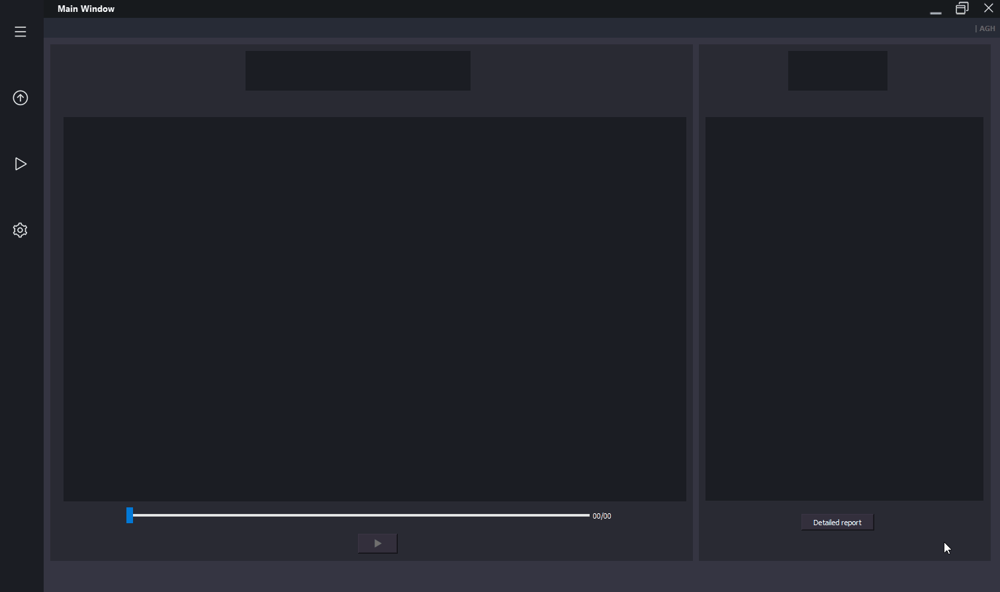
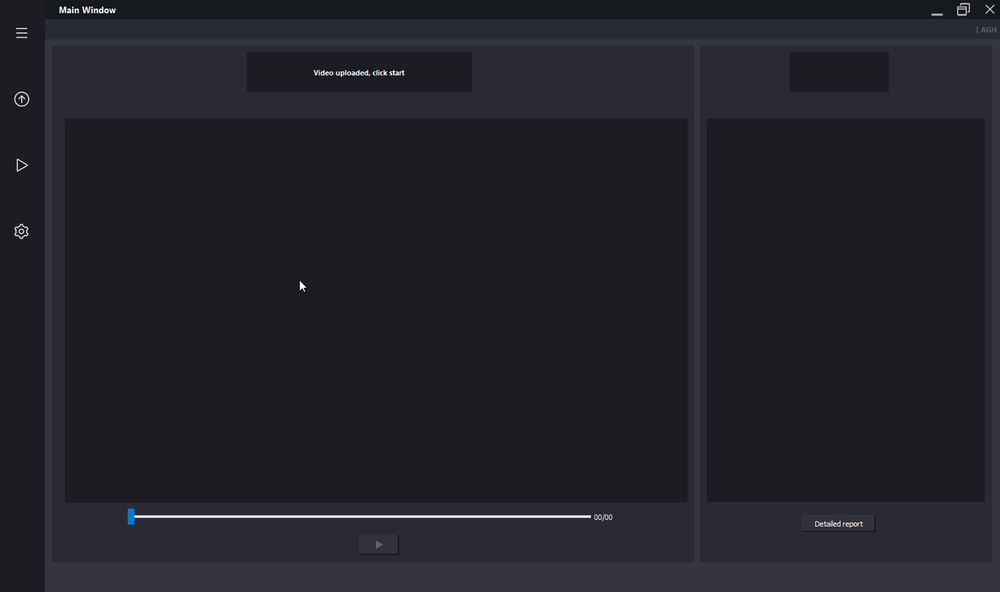
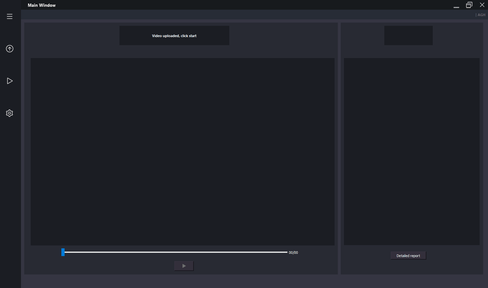
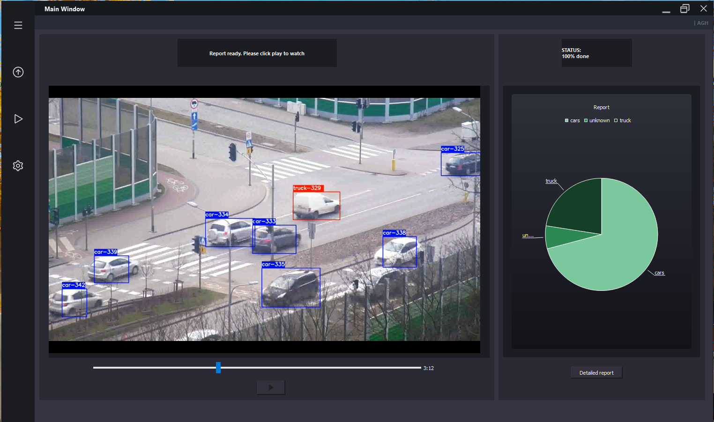

# Vehicle Detector
Chudy Arkadiusz, Kulig Sebastian, Wnęk Karol    
Inżynieria Oprogramowania AGH - Grupa A2

## Table of Contents
1. [Goal of the Project](#goal-of-the-Project)
2. [Project requirements](#project-requirements)
3. [Install instructions with supplied installer](#install-instructions-with-supplied-installer)
4. [Install requirements when configuring the environment by yourself](#install-requirements-when-configuring-the-environment-by-yourself)
5. [Usage of the application](#usage-of-the-application)

## Goal of the Project
This project's goal is to analyze a video in order to detect and recognize vehicles on the road. 
## Project requirements
* Application runs on Windows 10.
* Analyzed video's quality is to be FHD.
* Analysis of a singular video of duration up to 15 minutes.
* The output is to be a video file with outlined recognized vehicles, as well as a .csv file with the vehicles' recognition timestamps.
* The analysis runs at 10 frames per second on a middle-range laptop with an nVidia graphics card.
* There is no parallel analysis on multiple videos.
* A minimal size of a vehicle is 100x100 px.
* The detection success rate is to be at least 85%.
* The recognition of detected vehicles is to be at least 65%.
* A recognized vehicle is defined as one recognizable by an average human.
* There are four categories: 
	*  a car
	* a truck (including buses)
	* a two-wheeler (motorbike, bicycle)
	* unknown.
* The GUI has to include:
	* A button to upload a file to analysis
	* A start analysis button
	* Choice of a path to save the outputs
	* Playback of the analyzed video
## Install instructions with supplied installer
1. Run install.bat as an Administrator (rightclick on install.bat and "Run as administrator").
2. Type 1 when prompted to perform full installation.
3. Install Visual Studio Community 2019 (requirement on Windows) when prompted by the installer.
4. Install Python 3.8.0 with default settings.
5. Install CUDA 10.1 with default settings.
6. After a successful installation of the components, in application files, a model is built.

## Install requirements when configuring the environment by yourself
After unzipping files.zip, having installed the required software (Visual Studio [not Code], Python 3.8.0 and CUDA 10.1) build the model in \files\vd by running `python save_model.py --weights .\data\yolov4.weights --output .\checkpoints\yolov4-full-416 --model yolov4` .
## Usage of the application
### Loading a video file
 
### Choosing or changing output paths of the output video and the generated csv report
 
### Starting analysis
 
### Result screen

